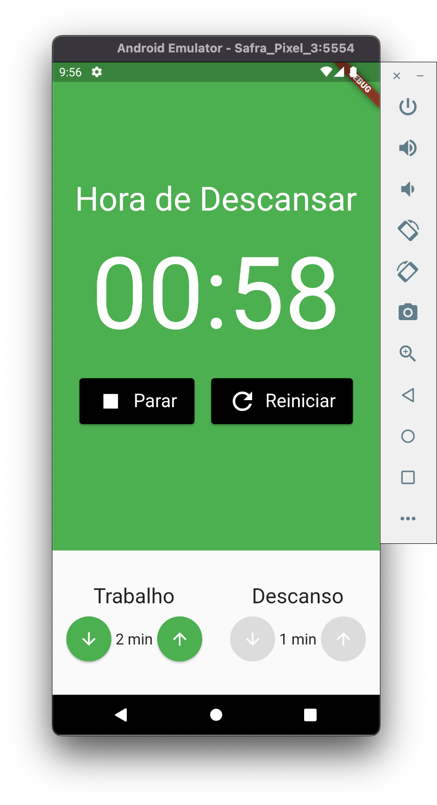
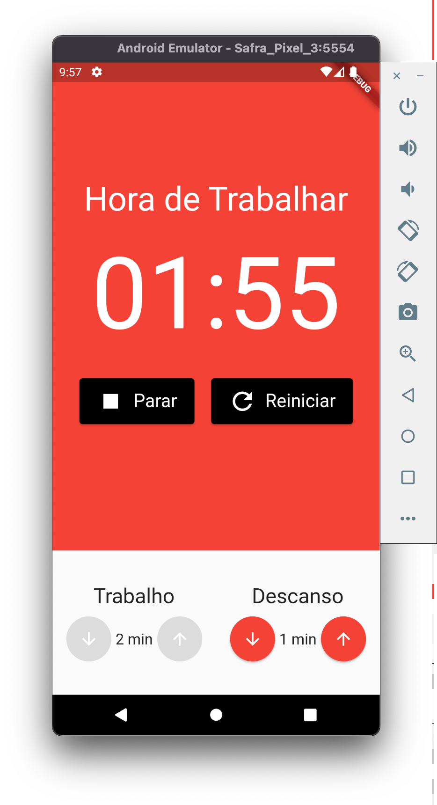

# Pomodoro

- Flutter
- Estudo do Mobx
- Mobx é uma biblioteca para gerenciamento de estados, locais ou globais (à partir de um provider). Baseia-se em observáveis, ação e reação.

A new Flutter project.

## Getting Started

- flutter pub get
- flutter pub run build_runner watch

This project is a starting point for a Flutter application.

A few resources to get you started if this is your first Flutter project:

- [Lab: Write your first Flutter app](https://docs.flutter.dev/get-started/codelab)
- [Cookbook: Useful Flutter samples](https://docs.flutter.dev/cookbook)

For help getting started with Flutter development, view the
[online documentation](https://docs.flutter.dev/), which offers tutorials,
samples, guidance on mobile development, and a full API reference.
